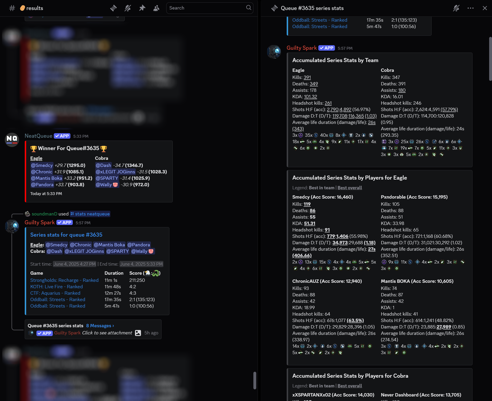
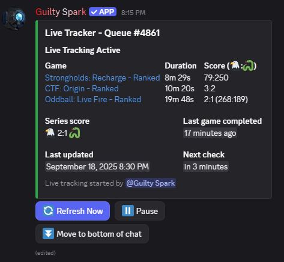
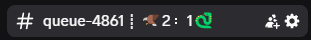

# Guilty Spark

**Official website: https://guilty-spark.app**

[](https://opensource.org/licenses/MIT)
[](https://nodejs.org/)
[](https://workers.cloudflare.com/)

A Halo Infinite operations platform spanning Discord automation, NeatQueue workflows, and web-based tracker overlays. Guilty Spark runs on [Cloudflare Workers](https://developers.cloudflare.com/workers/) and delivers queue-aware series stats, live match tracking, and individual tracker experiences for streamers and community operators.



## Features

- **Discord Series Intelligence**: Resolve NeatQueue series outcomes into rich game-by-game match breakdowns
- **Live Tracker Automation**: Track active series with periodic refresh, substitutions, and optional score-in-channel updates
- **Individual Tracker Management**: Build personal trackers and keep player-focused timelines live
- **OBS Overlay Workflows**: Generate overlay URLs from live tracker or individual tracker experiences
- **Halo Infinite Stats Integration**: Pull match statistics from Halo Waypoint pipelines
- **HCS Maps Generator**: Generate random HCS map sets with playlist and count selection, interactive UI, and user attribution
- **Identity Linking**: Connect Discord users to Xbox gamertags for reliable player matching
- **Privacy-Aware Operations**: Respect Halo Waypoint privacy settings and fail safely when visibility is restricted

## Quick Start

### Add to Your Discord Server

[**Invite Guilty Spark**](https://discord.com/oauth2/authorize?client_id=1290269474536034357&permissions=311385476096&integration_type=0&scope=bot+applications.commands) to your Discord server with the necessary permissions.

### Basic Setup

1. **Configure the bot**: Use `/setup` to configure server settings and NeatQueue integration
2. **Link accounts**: Users can use `/connect` to link their Discord accounts to Xbox gamertags
3. **Retrieve match statistics**: Use the `/stats` command to get Halo Infinite match and series stats
4. **Generate map sets**: Use the `/maps` command to generate random HCS map sets for your games
5. **Create tracker overlays**: Open the web tracker surfaces to configure overlay URLs for OBS scenes

### Web Experiences

Guilty Spark includes browser-based tools that complement Discord commands:

- **Live Tracker View** (`/tracker`): monitor active series state with scoreboard and progression context
- **Individual Tracker Manager** (`/individual-tracker`): manage personal trackers, tune settings, and generate stream overlays
- **Individual Tracker Viewer** (`/individual-tracker/:trackerId`): share public tracker views for player-focused monitoring
- **Player Follow Live** (`/u/:gamertag`): watch a single player's latest tracked context

These pages are designed for operators and streamers who need scene-ready telemetry beyond raw Discord message output.

## Commands

### `/setup` - Server Configuration

Configure Guilty Spark for your server preferences (admin only command)

```
/setup
```

Interactive configuration system with comprehensive options:

#### Basic Configuration

- **Stats Display Mode**: Choose between series-only or series + individual games
- **Channel Permissions**: Verify bot permissions in target channels

#### NeatQueue Integration Setup

- **Webhook Configuration**: Secure webhook authentication for automated stats
- **Channel Mapping**: Configure queue and results channels
- **Display Options**: Choose how stats are posted (threaded replies, new messages, dedicated channel)
- **Live Tracking**: Enable real-time match updates during series
- **NeatQueue Informer**: Announce player connections when queues start

### `/connect` - Link Discord to Xbox Account

Users link their Discord account to Xbox gamertag for automatic stat retrieval:

```
/connect
```

**Features:**

- **Gamertag Search**: Find Xbox accounts by name
- **Account Verification**: Confirm correct account before linking
- **Link Management**: Update or remove existing connections
- **Privacy Handling**: Graceful handling of restricted accounts

### `/stats` - Retrieve Match Statistics

Access stats data for a previously played NeatQueue series:

#### NeatQueue Series Stats

```
/stats neatqueue [channel] [queue_number]
```

Retrieves comprehensive statistics for completed NeatQueue series:

- `channel` (optional): Discord channel to search (defaults to current)
- `queue_number` (optional): Specific queue number (defaults to most recent)

https://github.com/user-attachments/assets/88edbc3c-975f-4a16-b2ba-0da80dfa5bf4

**Automated Process:**

1. Locates NeatQueue results in specified channel
2. Extracts participant Discord users
3. Matches users to Xbox gamertags via `/connect` links or username matching
4. Queries Halo Waypoint for custom games with all participants
5. Displays comprehensive match and series statistics

#### Individual Match Stats

```
/stats match <match_id>
```

Retrieves detailed statistics for any specific Halo match using its unique identifier.

### `/maps` - Generate HCS Map Sets

Generate random map sets for competitive play:

```
/maps [count] [playlist]
```

**Options:**

- `count`: Number of maps (1, 3, 5, 7; default: 5)
- `playlist`: Map pool (`HCS - current` or `HCS - historical`; default: current)

**Interactive Features:**

- Re-roll buttons for different map counts
- Playlist selector for switching map pools
- User attribution for generated sets

### `/track` - Manual Live Tracking

Start live tracking for ongoing NeatQueue series:

```
/track <queue_number> [channel]
```

**Note**: Live tracking typically starts automatically via NeatQueue webhooks. This command provides manual control when needed.

## NeatQueue Integration

Guilty Spark provides deep integration with NeatQueue queue management system, enabling automated workflows and real-time tracking.

### Configuration Requirements

**Essential Setup Steps:**

1. Configure webhook in NeatQueue pointing to your Guilty Spark instance
2. Set webhook secret for security via `/setup`
3. Map NeatQueue channels to Discord channels
4. Choose appropriate display mode for stats posting

### Automated Workflows

https://github.com/user-attachments/assets/bcaccc99-0815-4792-a7ea-2c320cd40ef7

**Event-Driven Automation:**

1. **Series Start**: NeatQueue webhooks notify Guilty Spark when series begin
2. **Team Creation**: Automatic live tracking initialization if enabled
3. **Match Completion**: Real-time statistics retrieval and posting
4. **Series End**: Final statistics compilation and live tracking cleanup

**Display Options:**

- **Threaded Replies**: Stats posted as replies to NeatQueue results messages
- **Channel Messages**: New messages in results channel or dedicated stats channel
- **Live Updates**: Real-time series overview during active matches

### Live Tracker - Real-Time Match Updates

**Automated real-time tracking** for ongoing NeatQueue series with comprehensive match monitoring.

**Core Features:**

- **Automatic Lifecycle**: Starts when teams are created, stops when series complete
- **Live Updates**: Series overview refreshes every 3 minutes during active matches
- **Interactive Controls**: Refresh, pause, and resume
- **Substitution Support**: Automatic handling of player changes with chronological tracking
- **Update queue channel name**: In progress series score in the channel name

### Individual Tracker and Stream Overlay

Individual Tracker extends Guilty Spark beyond queue-only operations.

**Capabilities:**

- Manage player-focused trackers independently of a single queue lifecycle
- Configure overlay composition, ticker behavior, and display sections
- Generate shareable browser URLs for OBS Browser Source usage
- Support both in-series and matchmaking display contexts for stream overlays

This workflow is ideal when broadcasts require consistent per-player storytelling rather than queue-wide snapshots.





### NeatQueue Informer

**Real-time player connection announcements** when queues start:

**Features:**

- Announces which players join queues immediately
- Server-wide configuration via `/setup`
- Automatic permission checking and self-disabling if missing
- Works alongside other NeatQueue integration features

**Requirements:**

- View Channel and Send Messages permissions
- Enabled via `/setup` → "Configure NeatQueue Informer"

#### Permissions Required

- **View Channel**: Read the channel where tracking is posted
- **Send Messages**: Post initial live tracker message
- **Use External Emojis**: Display team emojis and status indicators

### Troubleshooting

**Live Tracker Issues:**

- Verify Live Tracking enabled in `/setup` → "Configure NeatQueue Integration"
- Check bot permissions in target channels (View Channel, Send Messages)
- Use manual refresh button for immediate updates during API issues

**Stats Not Posting:**

- Confirm webhook configuration and secret match NeatQueue settings
- Verify channel mapping in `/setup`
- Check that results messages contain expected Discord user mentions

## Development Setup

### Prerequisites

- Node.js ≥ 24.11.0
- Cloudflare account with Workers and D1 access
- Discord application with bot token

### Local Development

1. **Clone the repository**:

   ```bash
   git clone https://github.com/davidhouweling/guilty-spark.git
   cd guilty-spark
   ```

2. **Install dependencies**:

   ```bash
   npm install
   ```

3. **Configure environment**:
   - Follow [Discord/Cloudflare sample app guide](https://github.com/discord/cloudflare-sample-app) for initial setup
   - Create `.dev.vars` file with required environment variables
   - Set up Cloudflare D1 database and KV namespace

4. **Register Discord commands**:

   ```bash
   npm run register
   ```

5. **Start development server**:

   ```bash
   npm start
   ```

## Technical Features

### Resilient Halo API Integration

Due to historical issues encountered in the past when Cloudflare workers would encounter a HTTP 526 when calling Halo Waypoint, a proxy call can be leverage instead. With the blessing of Haloquery, we can proxy calls to their service.

**Control Mechanisms**:

- **Environment Variable**: `PROXY_WORKER_URL` - Set to proxy server URL (e.g., `https://haloquery.com/proxy`)
- **Master Toggle**: `halo:proxy:enabled` KV key - Manual control via Cloudflare UI
- **Auto-Activation**: `halo:proxy:circuit_breaker` KV key - Automatically managed during incidents

**Error Tracking**: All proxy activations and rate limit errors are logged to Sentry for monitoring

This ensures the bot remains operational even during Halo Waypoint API incidents, providing a seamless experience for users.

## Privacy & Security

### Data Handling

- Minimal data collection focused on functionality
- Respects Halo Waypoint privacy settings
- Secure webhook authentication with HMAC
- No storage of sensitive Xbox authentication tokens

### Privacy Controls

- Users control their own account linking
- Graceful handling of private Halo profiles
- Option to remove account associations

## Support & Community

### Getting Help

- **Issues**: Report bugs or request features on [GitHub Issues](https://github.com/davidhouweling/guilty-spark/issues)
- **Discussions**: Join community discussions for support and feature requests

### Contributing

Contributions are welcome! Please read our contributing guidelines and submit pull requests for any improvements.

### License

This project is licensed under the MIT License - see the [LICENSE](LICENSE) file for details.

## Additional Resources

### Documentation

- [Terms of Service](./TERMS_OF_SERVICE.md) - Legal terms for using Guilty Spark
- [Privacy Policy](./PRIVACY_POLICY.md) - How we handle your data
- [Content Asset Requests](./CONTENT_ASSET_REQUESTS.md) - Requested screenshots and clips for website content refresh
- [Cloudflare Workers Docs](https://developers.cloudflare.com/workers/) - Platform documentation
- [Discord API Docs](https://discord.com/developers/docs) - Discord development resources

### Related Projects

- [NeatQueue](https://neatqueue.com/) - Queue management system
- [Halo Infinite API](https://github.com/dgreene1/halo-infinite-api) - Halo Waypoint API wrapper

---

**Made with ❤️ for the Halo community**

_Guilty Spark is not affiliated with Microsoft, 343 Industries, or Halo. All trademarks are property of their respective owners._
