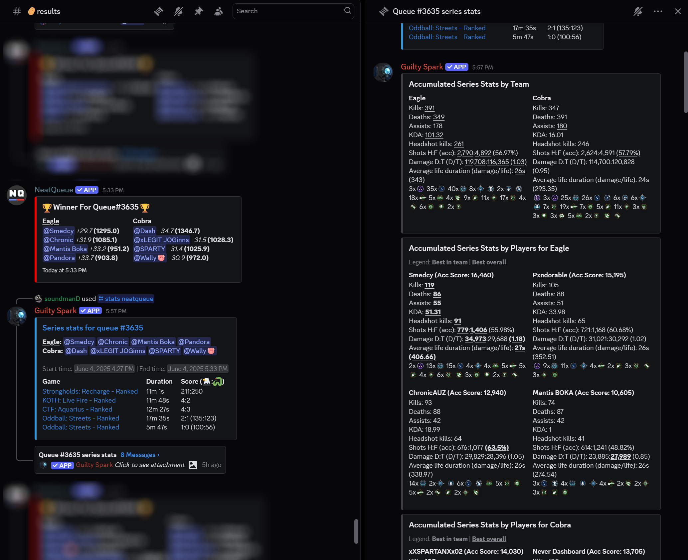

# Guilty Spark

[](https://opensource.org/licenses/MIT)
[](https://nodejs.org/)
[](https://workers.cloudflare.com/)

A powerful [Discord Bot](https://discord.com/oauth2/authorize?client_id=1290269474536034357&permissions=311385476096&integration_type=0&scope=bot+applications.commands) built on [Cloudflare Workers](https://developers.cloudflare.com/workers/) that seamlessly integrates Halo Infinite match statistics from Halo Waypoint with Discord communities. The bot specializes in working with NeatQueue-managed custom game series, providing automated statistics posting and detailed match analysis.



## ✨ Features

- **🎮 Halo Infinite Stats Integration**: Pull match statistics directly from Halo Waypoint
- **🤖 NeatQueue Integration**: Automated webhook-based stats posting for custom game series
- **🗺️ HCS Maps Generator**: Generate random HCS map sets with playlist and count selection, interactive UI, and user attribution
- **🔗 Discord-Halo Account Linking**: Connect Discord users to their Xbox gamertags
- **📊 Rich Match Embeds**: Beautiful, game-mode-specific stat displays
- **⚙️ Comprehensive Setup System**: Interactive configuration for servers and NeatQueue integration
- **🔄 Automated Workflows**: Automatic stats posting when matches complete
- **🛡️ Privacy-Aware**: Respects Halo Waypoint privacy settings

## 🚀 Quick Start

### Add to Your Discord Server

[**Invite Guilty Spark**](https://discord.com/oauth2/authorize?client_id=1290269474536034357&permissions=311385476096&integration_type=0&scope=bot+applications.commands) to your Discord server with the necessary permissions.

### Basic Setup

1. **Configure the bot**: Use `/setup` to configure server settings and NeatQueue integration
2. **Link accounts**: Users can use `/connect` to link their Discord accounts to Xbox gamertags
3. **Retrieve match statistics**: Use the `/stats` command to get Halo Infinite match and series stats
4. **Generate map sets**: Use the `/maps` command to generate random HCS map sets for your games

## 📋 Commands

### `/setup` - Server Configuration

Configure Guilty Spark for your server preferences (admin only command)

```
/setup
```

Interactive configuration system with comprehensive options:

#### Basic Configuration

- **Stats Display Mode**: Choose between series-only or series + individual games
- **Channel Permissions**: Verify bot permissions in target channels

#### NeatQueue Integration Setup

- **Webhook Configuration**: Secure webhook authentication for automated stats
- **Channel Mapping**: Configure queue and results channels
- **Display Options**: Choose how stats are posted (threaded replies, new messages, dedicated channel)
- **Live Tracking**: Enable real-time match updates during series
- **NeatQueue Informer**: Announce player connections when queues start

### `/connect` - Link Discord to Xbox Account

Users link their Discord account to Xbox gamertag for automatic stat retrieval:

```
/connect
```

**Features:**

- **Gamertag Search**: Find Xbox accounts by name
- **Account Verification**: Confirm correct account before linking
- **Link Management**: Update or remove existing connections
- **Privacy Handling**: Graceful handling of restricted accounts

### `/stats` - Retrieve Match Statistics

Access stats data for a previously played NeatQueue series:

#### NeatQueue Series Stats

```
/stats neatqueue [channel] [queue_number]
```

Retrieves comprehensive statistics for completed NeatQueue series:

- `channel` (optional): Discord channel to search (defaults to current)
- `queue_number` (optional): Specific queue number (defaults to most recent)


**Automated Process:**

1. Locates NeatQueue results in specified channel
2. Extracts participant Discord users
3. Matches users to Xbox gamertags via `/connect` links or username matching
4. Queries Halo Waypoint for custom games with all participants
5. Displays comprehensive match and series statistics

#### Individual Match Stats

```
/stats match <match_id>
```

Retrieves detailed statistics for any specific Halo match using its unique identifier.

### `/maps` - Generate HCS Map Sets

Generate random map sets for competitive play:

```
/maps [count] [playlist]
```

**Options:**

- `count`: Number of maps (1, 3, 5, 7; default: 5)
- `playlist`: Map pool (`HCS - current` or `HCS - historical`; default: current)

**Interactive Features:**

- Re-roll buttons for different map counts
- Playlist selector for switching map pools
- User attribution for generated sets

### `/track` - Manual Live Tracking

Start live tracking for ongoing NeatQueue series:

```
/track <queue_number> [channel]
```

**Note**: Live tracking typically starts automatically via NeatQueue webhooks. This command provides manual control when needed.

## 🤝 NeatQueue Integration

Guilty Spark provides deep integration with NeatQueue tournament management system, enabling automated workflows and real-time tracking.

### Configuration Requirements

**Essential Setup Steps:**

1. Configure webhook in NeatQueue pointing to your Guilty Spark instance
2. Set webhook secret for security via `/setup`
3. Map NeatQueue channels to Discord channels
4. Choose appropriate display mode for stats posting

### Automated Workflows


**Event-Driven Automation:**

1. **Series Start**: NeatQueue webhooks notify Guilty Spark when series begin
2. **Team Creation**: Automatic live tracking initialization if enabled
3. **Match Completion**: Real-time statistics retrieval and posting
4. **Series End**: Final statistics compilation and live tracking cleanup

**Display Options:**

- **Threaded Replies**: Stats posted as replies to NeatQueue results messages
- **Channel Messages**: New messages in results channel or dedicated stats channel
- **Live Updates**: Real-time series overview during active matches

### 🟢 Live Tracker - Real-Time Match Updates

**Automated real-time tracking** for ongoing NeatQueue series with comprehensive match monitoring.

**Core Features:**

- **Automatic Lifecycle**: Starts when teams are created, stops when series complete
- **Live Updates**: Series overview refreshes every 3 minutes during active matches
- **Interactive Controls**: Pause ⏸️, Resume ▶️, Stop ⏹️, and Refresh 🔄 buttons
- **Substitution Support**: Automatic handling of player changes with chronological tracking
- **Error Recovery**: Intelligent retry logic with exponential backoff

#### User Interface Example

```
// TODO: screenshot here
```

### NeatQueue Informer

**Real-time player connection announcements** when queues start:

**Features:**

- Announces which players join queues immediately
- Server-wide configuration via `/setup`
- Automatic permission checking and self-disabling if missing
- Works alongside other NeatQueue integration features

**Requirements:**

- View Channel and Send Messages permissions
- Enabled via `/setup` → "Configure NeatQueue Informer"

#### Permissions Required

- **View Channel**: Read the channel where tracking is posted
- **Send Messages**: Post initial live tracker message
- **Use External Emojis**: Display team emojis and status indicators

### Troubleshooting

**Live Tracker Issues:**

- Verify Live Tracking enabled in `/setup` → "Configure NeatQueue Integration"
- Check bot permissions in target channels (View Channel, Send Messages)
- Use manual refresh button for immediate updates during API issues

**Stats Not Posting:**

- Confirm webhook configuration and secret match NeatQueue settings
- Verify channel mapping in `/setup`
- Check that results messages contain expected Discord user mentions

## 🛠️ Development Setup

### Prerequisites

- Node.js ≥ 22.11.0
- Cloudflare account with Workers and D1 access
- Discord application with bot token

### Local Development

1. **Clone the repository**:

   ```bash
   git clone https://github.com/davidhouweling/guilty-spark.git
   cd guilty-spark
   ```

2. **Install dependencies**:

   ```bash
   npm install
   ```

3. **Configure environment**:
   - Follow [Discord/Cloudflare sample app guide](https://github.com/discord/cloudflare-sample-app) for initial setup
   - Create `.dev.vars` file with required environment variables
   - Set up Cloudflare D1 database and KV namespace

4. **Register Discord commands**:

   ```bash
   npm run register
   ```

5. **Start development server**:

   ```bash
   npm start
   ```

6. **Set up ngrok tunnel** (for webhook testing):
   ```bash
   npm run ngrok
   ```

## 🔒 Privacy & Security

### Data Handling

- Minimal data collection focused on functionality
- Respects Halo Waypoint privacy settings
- Secure webhook authentication with HMAC
- No storage of sensitive Xbox authentication tokens

### Privacy Controls

- Users control their own account linking
- Graceful handling of private Halo profiles
- Option to remove account associations

## 🆘 Support & Community

### Getting Help

- **Issues**: Report bugs or request features on [GitHub Issues](https://github.com/davidhouweling/guilty-spark/issues)
- **Discussions**: Join community discussions for support and feature requests

### Contributing

Contributions are welcome! Please read our contributing guidelines and submit pull requests for any improvements.

### License

This project is licensed under the MIT License - see the [LICENSE](LICENSE) file for details.

## 📚 Additional Resources

### Documentation

- [Terms of Service](./TERMS_OF_SERVICE.md) - Legal terms for using Guilty Spark
- [Privacy Policy](./PRIVACY_POLICY.md) - How we handle your data
- [Cloudflare Workers Docs](https://developers.cloudflare.com/workers/) - Platform documentation
- [Discord API Docs](https://discord.com/developers/docs) - Discord development resources

### Related Projects

- [NeatQueue](https://neatqueue.com/) - Tournament management system
- [Halo Infinite API](https://github.com/dgreene1/halo-infinite-api) - Halo Waypoint API wrapper

---

**Made with ❤️ for the Halo community**

_Guilty Spark is not affiliated with Microsoft, 343 Industries, or Halo. All trademarks are property of their respective owners._
